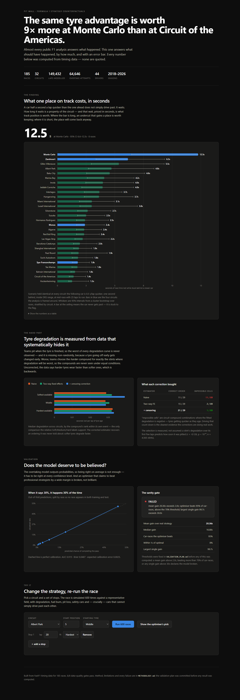

# Pit Wall

**A race-strategy counterfactual engine for Formula 1.** Almost every public F1
analysis answers *what happened*. This one answers what **should** have
happened, by how much, and with an honest error bar.

[](https://github.com/Ghostboy789/pitwall-f1-strategy/actions/workflows/ci.yml)

---

## The finding

> **The same tyre advantage is worth nine times more at Monaco than at the
> Circuit of the Americas — and the two are statistically distinguishable.**



A car half a second a lap quicker than the one ahead does not simply drive past.
It waits. How long it waits is a property of the circuit, and that wait, priced
in seconds, is what track position is worth.

Holding the scenario identical everywhere — follower 0.5 s/lap quicker, one
second behind, DRS available, mid-race, 25 laps to run:

| Circuit | Pass chance per lap | Cost of being stuck | 95% interval | Races |
|---|---|---|---|---|
| **Monte Carlo** | 1.6% | **12.5 s** (stuck to the flag) | 6.6 – 12.5 | 8 |
| **Zandvoort** | 8.0% | 6.27 s | 3.4 – 9.5 | 6 |
| Gilles Villeneuve | 9.2% | 5.46 s | 3.0 – 9.5 | 7 |
| Albert Park | 10.4% | 4.81 s | 2.7 – 8.6 | 6 |
| **Monza** | 20.4% | 2.45 s | 1.7 – 4.2 | 8 |
| **Spa-Francorchamps** | 27.6% | 1.81 s | 1.3 – 2.8 | 8 |
| Bahrain International | 31.8% | 1.57 s | 1.2 – 2.7 | 8 |
| Circuit of the Americas | 34.6% | 1.44 s | 1.0 – 2.5 | 7 |

Monaco against COTA is **8.7×** with non-overlapping intervals; against Bahrain
**8.0×**, and against Monza **5.1×** — all three distinguishable. (The strapline
is restricted to circuits with at least five races, so the claim is never
anchored on the thinnest sample on the page.)

**What is not established, stated as plainly:** adjacent circuits are *not*
separable. Zandvoort against Monza (2.6×) and Spa against Monza (0.7×) both
have overlapping intervals. The finding is a real spread across the extremes,
not a precise ranking of every circuit.

**One result contradicts the premise the project was framed on.** Spa was
expected to sit near Monza as an easy-overtaking circuit; it comes out *easier*
than Monza (27.6% vs 20.4% conversion). That is what the data says and it is
reported as such rather than smoothed over.

---

## Why this is hard, and what was done about it

The headline number is one line of arithmetic. Everything else exists because
the inputs to it are booby-trapped.

### Tyre degradation is measured from data that systematically hides it

Teams pit when a tyre is finished, so the worst of every degradation curve is
missing — and missing non-randomly. **Measured, not assumed:** a stint's
degradation over its first five laps predicts how soon it was pitted
(r = −0.126, p = 1.7×10⁻¹⁷, across 4,565 stints).

A second, larger selection was found during the build: teams choose the *harder*
compound for exactly the stints where degradation will be worst, so the
compounds are never observed under equal conditions. Uncorrected, **the data
says harder tyres degrade faster than softer ones** — which is backwards.

Three estimators, reported side by side because the progression is the result:

| Estimator | Softest | Middle | Hardest | Correct ordering | Physically impossible cells |
|---|---|---|---|---|---|
| Naive | 0.0317 | 0.0258 | 0.0325 | 11 / 29 | **11 / 89** |
| + two-way fixed effects | 0.0321 | 0.0295 | 0.0320 | 15 / 29 | 2 / 89 |
| **+ censoring correction** | **0.0386** | 0.0272 | 0.0332 | **21 / 29** | **1 / 89** |

The final estimator recovers an ordering it was never told about — softer tyres
degrade faster — and drives negative degradation (tyres getting *quicker* with
age) from 11 cells to 1.

### Compound labels are relative, not absolute

`SOFT` at one event is different rubber from `SOFT` at another. In this dataset
the label **`SOFT` is the hardest available compound in 3,006 laps, the middle
in 2,272, and the softest in 5,772.** Pooling by label merges three tyres.
No public dataset of per-event Pirelli allocations exists (see `SOURCES.md`), so
compounds are ranked *within their own event* — which is what the label means.

### Fuel burn confounds everything, and cannot be fully separated

A negative result, reported as one: fuel burn and track evolution are **not
separately identified** in race data. Zero of 27 circuits met the separability
threshold; median correlation **0.9981**.

What *is* identified — and is what matters — is fuel against degradation. Two
independent specifications agree without being calibrated to:

- mixed-effects pace model: **−0.0535 s/lap** (IQR −0.068 to −0.046)
- entirely separate degradation model: **−0.0574 s/lap**
- **all 27 circuits** fall inside the physically expected band (~1.7 kg/lap ×
  ~0.03 s/kg ≈ 0.05 s/lap)
- and it scales with lap distance as fuel must and evolution need not:
  **r = −0.759, p = 4×10⁻⁶**

### Circuits are not what the data calls them

FastF1's `Location` gives 35 strings for 32 real circuits. Monaco/Monte Carlo,
Singapore/Marina Bay, Miami/Miami Gardens and Yas Island/Yas Marina are each one
circuit named twice — while **`Sakhir` is two different layouts** (the 2020
Sakhir GP ran Bahrain's 3.5 km outer loop). Grouping by `Location` would both
split and merge circuits, corrupting the per-circuit number this project exists
to produce.

---

## Validation

The validation plan was **committed before any result was computed**
(`VALIDATION_PLAN.md`); the commit history is the evidence.

**Overtaking is calibrated, not just discriminative.** Out-of-fold predictions
split by race (never by row — opportunities from one race share weather, track
state and the same two cars):

- **AUC 0.915 · Brier 0.0487 · expected calibration error 0.0025** on a 7.7%
  base rate, over 64,646 opportunities.

**The pass detector validates against reality without being tuned to it:**
Monaco 3.8 passes per race, rising to Las Vegas 40.7 and Portimão 37.5.

**Leakage was checked, not assumed.** `pace_delta_s` is built from clean-air laps
across the whole race, so it can see past the pass. Ablating it costs 0.015 AUC
(0.908 → 0.893); `gap_s` alone reaches 0.851.

**All 8 data-quality gates pass** across 203,644 laps.

### The sanity gate failed, and that is the most useful thing in this repo

Validation V3 asks a question with a pre-registered answer: how much better than
real F1 strategists does the optimiser claim to be? Thresholds were fixed in
`VALIDATION_PLAN.md` before anything was computed — a mean gain above 2.0 s,
beating more than 70% of car-races, or any single gain above 30 s declares the
model **broken**, not brilliant.

The first run tripped **all three**:

| Criterion | Result | Threshold |
|---|---|---|
| Mean gain over real strategy | **23.49 s** | 2.0 s |
| Car-races the optimiser beat | **97%** | 70% |
| Largest single claimed gain | **107.6 s** | 30 s |

**It was not beating strategists. It was beating a corrupted reconstruction of
what they did.** Strategies were inferred from FastF1's `Stint` counter, which
increments for reasons other than a pit stop, so the audit invented races nobody
ran:

```
start-r1 L2->r1  L3->r1  L36->r2 L63->r0    stops on laps 2 AND 3
start-r1 L35->r2 L36->r2 L37->r2 L45->r2    three stops in three laps
start-r1 L1->r1  ...                        a lap-1 stop refitting the
                                            compound already on the car
```

The simulator charges full pit loss per stop, so a car credited with five
phantom stops paid ~110 s its real race never spent. The signature was
unmistakable once looked for — mean claimed gain rose monotonically with the
number of *reconstructed* stops:

| Reconstructed stops | 1 | 2 | 3 | 4 |
|---|---|---|---|---|
| Mean claimed gain | 10.9 s | 22.0 s | 47.8 s | 69.6 s |

That is the shape of an artefact, not of a strategic insight.

**The fix:** a stop is an in-lap — the authoritative signal — and only that.
Consecutive in-laps collapse to one stop, a stop on the final lap is ignored,
and a reconstruction claiming more than four stops is dropped rather than
modelled. Reconstruction now looks like real F1: a 2021 race resolves to 11
one-stops, 8 two-stops and 1 three-stop.

Without the gate, this project would have published a model claiming it could
save professional race strategists twenty-three seconds a race. The current
verdict is in `MORNING_REPORT.md` and on the dashboard.

---

## Bugs this project found in itself

Kept in the history deliberately. Each was caught by a number being physically
impossible, not by a test failing.

| Symptom | Cause |
|---|---|
| Fuel coefficient of **+4.46 s per lap** | `fuel_burned` and `race_progress` are an exact affine transform within a race |
| Every degradation cell **negative** | centring within a stint makes tyre age and fuel the identical vector |
| 13 circuits with the **identical** pass probability (0.083655) | the overtaking model had no circuit term — only DRS-zone count and street/not |
| Track position worth **exactly nothing** | blocking resolved against the post-lap order, so every faster car escaped 100% of the time |
| Imola pit loss of **45.9 s** (published ~28) | wet races included; an out-lap on intermediates is not pit-lane time |
| Every circuit shrunk to **one** caution rate | binomial SE over laps treated 300 correlated laps as 300 trials |
| The optimiser's "top 6" was **one plan shifted a lap** | ranked globally instead of by strategy family |
| A data-quality gate failing on **565 stints** | the gate was wrong — those are used tyre sets, correctly flagged |
| Optimiser beating real strategy by **23.5 s** | stops inferred from a stint counter, inventing pit stops nobody made |
| A stop at lap 37 surviving a 35/36/37 run | compared against the last *accepted* stop, not the last in-lap seen |

---

## Running it

```bash
python -m venv .venv && .venv/Scripts/pip install -r requirements.txt
python -m pitwall.ingest              # ~185 races, resumable
python -m pitwall.backfill_results    # grid positions, rate-paced
python -m pitwall.pipeline            # every model, one command
python -m scripts.run_audit --races 40
uvicorn app.main:app --reload
```

Then open <http://127.0.0.1:8000>.

Everything is reproducible from a clean clone: fixed seed (`config.SEED`),
pinned `requirements.txt`, and one command per stage. The app degrades honestly
if artefacts are missing — it returns 503 with instructions rather than
crashing.

---

## Layout

```
pitwall/
  config.py        scope, eras, thresholds fixed before results
  circuits.py      canonical circuit identity (trap T6)
  compounds.py     within-event relative hardness (trap T1)
  ingest.py        resumable ingestion with a failure manifest
  dataset.py       lap filters L1-L5
  quality.py       data-quality gates + exclusion rules E1-E5
  models/
    pace.py        per-circuit mixed models + empirical-Bayes pooling
    degradation.py three estimators: naive, two-way FE, + censoring
    overtaking.py  pass detection, calibration, circuit effects
    raceparams.py  empirical pit loss + caution hazard
  sim.py           Monte Carlo with the blocking mechanic
  optimize.py      closed-form enumeration then simulation
  audit.py         counterfactual audit + the sanity gate
  trackposition.py the headline metric
app/               FastAPI + Jinja2 + hand-rolled SVG charts
tests/             64 tests
```

---

## Honest positioning

Monte Carlo race simulation is well-trodden and this project does not claim to
have invented it (prior art in `SOURCES.md`). What is uncommon in the public
work surveyed: correcting the censoring in degradation data, publishing a
calibration curve rather than only a discrimination score, comparing the value
of track position *across* circuits as the output, and a pre-registered sanity
gate that treats an implausibly good optimiser as evidence of a broken model.

Full method, every trap, and ten named limitations: **[`METHODOLOGY.md`](METHODOLOGY.md)**.
