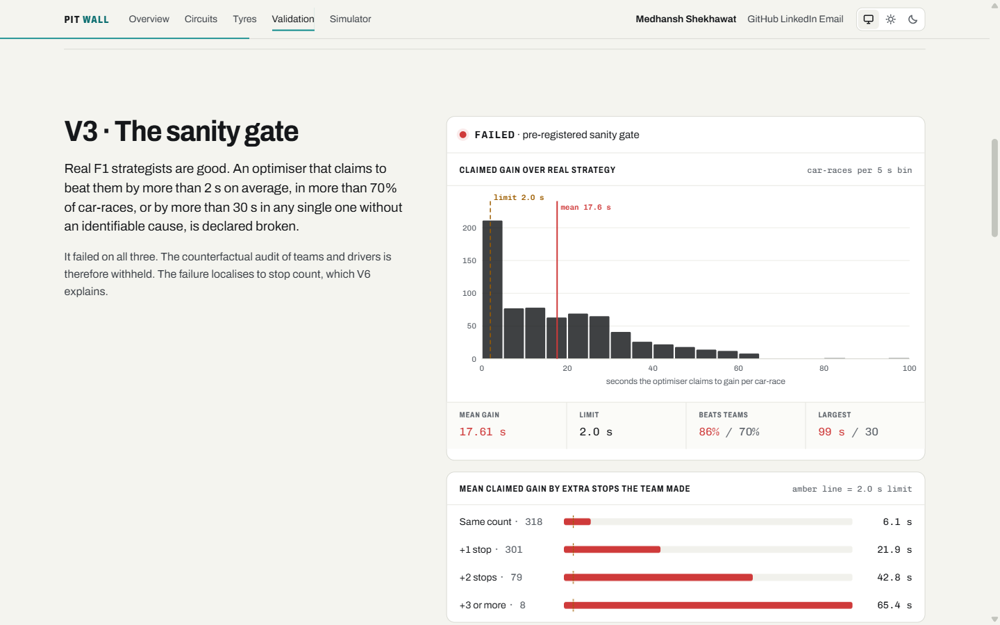
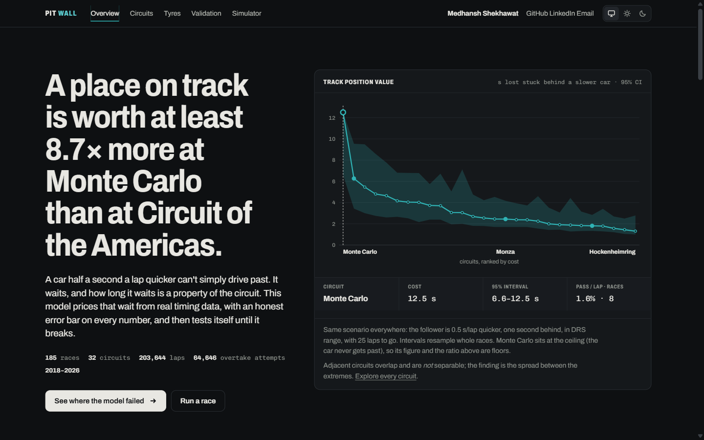
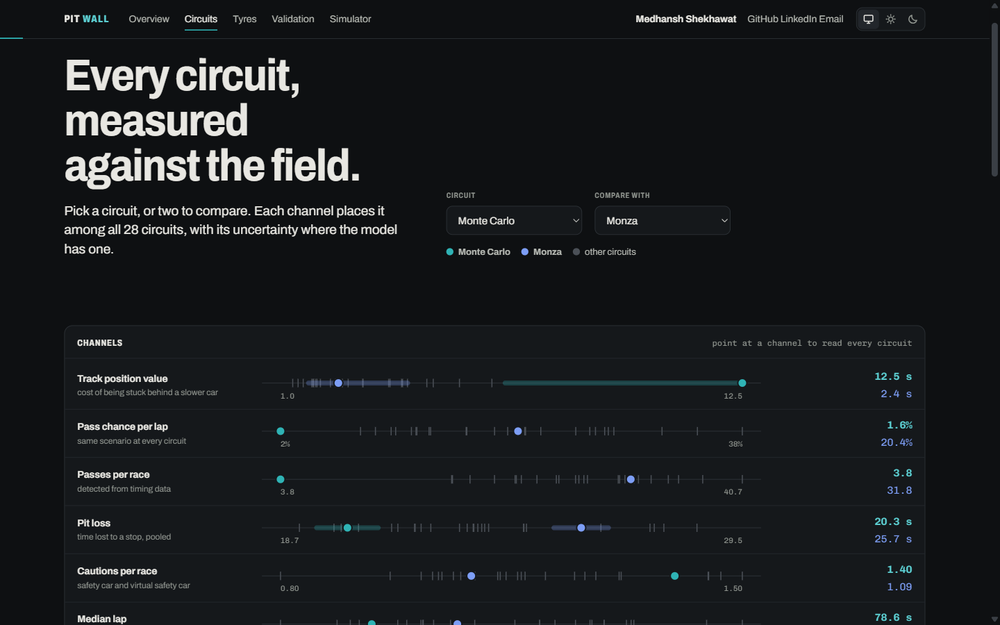
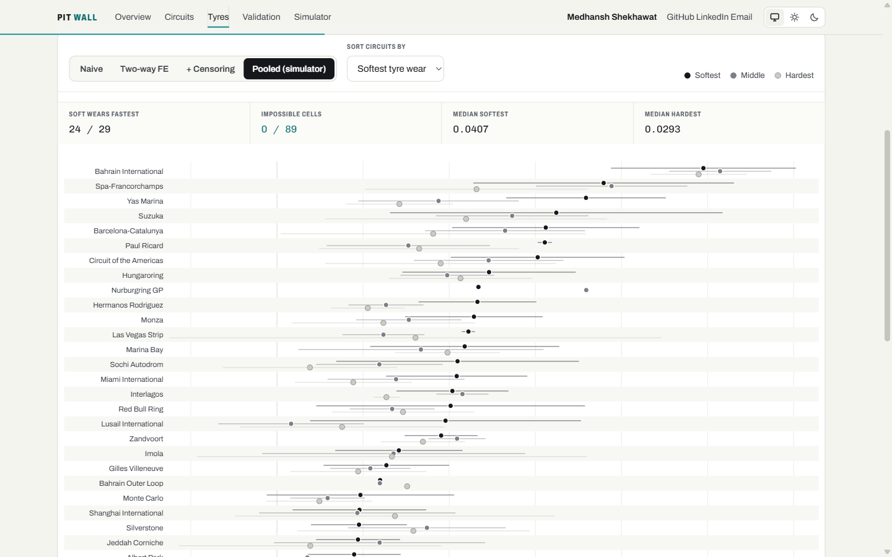

# Pit Wall

**An F1 race-strategy model built from 185 races, validated until it failed, and diagnosed rather than tuned.**

[](https://github.com/Ghostboy789/pitwall-f1-strategy/actions/workflows/ci.yml)


**[Live dashboard →](https://pitwall-f1-strategy.onrender.com)** · by **Medhansh Shekhawat** · [LinkedIn](https://www.linkedin.com/in/medhansh-shekhawat) · [GitHub](https://github.com/Ghostboy789)

<sub>Hosted on a free tier that sleeps when idle: the first visit can take about a minute to wake.</sub>


Most public F1 analysis answers *what happened*. Pit Wall asks what **should** have happened, by how much, and with an honest error bar. It prices what a place on track is worth at every circuit, then puts its own strategy optimiser through a validation plan written before any result existed. The optimiser failed that plan. The failure was measured, localised and explained, and the claims that depended on it were withheld.

---

## The finding

> **A place on track is worth at least 8.7× more at Monte Carlo than at the Circuit of the Americas, and the two are statistically distinguishable.**

Same scenario at every circuit: the follower is 0.5 s/lap quicker, one second behind, in DRS range, with 25 laps to go.

| Circuit | Pass chance per lap | Cost of being stuck | 95% interval | Races |
|---|---|---|---|---|
| **Monte Carlo** | 1.6% | **12.5 s** (stuck to the flag) | 6.6 – 12.5 | 8 |
| Zandvoort | 8.0% | 6.3 s | 3.4 – 9.5 | 6 |
| Gilles Villeneuve | 9.2% | 5.5 s | 3.0 – 9.5 | 7 |
| Monza | 20.4% | 2.4 s | 1.7 – 4.2 | 8 |
| Spa-Francorchamps | 27.6% | 1.8 s | 1.3 – 2.8 | 8 |
| Bahrain International | 31.8% | 1.6 s | 1.2 – 2.7 | 8 |
| **Circuit of the Americas** | 34.6% | **1.4 s** | 1.0 – 2.5 | 7 |

Intervals are a cluster bootstrap over races, stratified by circuit. Monte Carlo sits at the ceiling (the car never gets past), so its figure and the ratio are **floors**.

**What is not established:** adjacent circuits are *not* separable (Zandvoort vs Monza, Spa vs Monza both overlap). The finding is the spread between the extremes, not a ranking of every track. And Spa comes out *easier* to pass at than Monza, against the premise the project started from; that is reported, not smoothed.

---

## How it was tested

Every check below was written into [`VALIDATION_PLAN.md`](VALIDATION_PLAN.md), with the limits that would declare the model broken, **before any result was computed**. The commit history is the evidence.

| | Check | Result |
|---|---|---|
| V1 | Predict finishing order in held-out seasons | **Not run.** Listed, not dropped |
| V2 | Overtaking probabilities calibrated, out-of-fold by race | **Pass.** AUC 0.915 · Brier 0.0487 · ECE 0.0025 on 64,646 opportunities |
| V3 | Does the optimiser claim implausible gains over real strategists? | **Fail.** 17.6 s mean claimed gain against a 2.0 s limit |
| V4 | Ablations | **Partial.** Leakage only: removing the pace feature costs 0.015 AUC |
| V5 | Structural data-quality gates | **Pass.** 8 of 8 across 203,644 laps |
| V6 | Does the simulator price strategy like real races? *(added after V3 failed)* | **Fail.** See below |

### The sanity gate failed, and why



An optimiser that claims to beat professional strategists by a wide margin is broken, not brilliant. This one claimed 17.6 s per car-race. Four rounds of genuine fixes, each a real bug, moved it 23.5 → 21.3 → 20.4 → 17.7 s, then fixing stopped: adjusting a model until a pre-registered check passes is how such a check gets quietly defeated.

The failure sits almost entirely in **how many times** cars stopped. When the optimiser agrees with the team's stop count, the median claimed gain is 2.1 s. Each extra stop the team made adds almost exactly one pit stop of phantom gain (21.9 s for one, 42.8 s for two).

To find out why, V6 costs the **same 1,893 cars in 132 races**, each on the strategy it actually ran, twice: from real finishing times, and from simulated replays.

| Cost of… | Real races | Simulator | Simulator − real (paired) |
|---|---|---|---|
| One extra pit stop | −1.0 s [−7.1, +4.2] | +8.8 s | **+9.9 s [+2.3, +17.3]** |
| Uneven stints (per unit of longest-stint share) | −4.4 s [−42, +32] | +118 s | **+122 s [+78, +167]** |

**Real finishing times are insensitive to both; the simulator charges for both.** The per-lap tyre model is right (held-out calibration 1.02); what fails is the step from lap to race, because the simulator runs every car flat out on its fitted wear rate while real drivers manage their tyres.

Ruled out on the way, each with a number: simulation noise (0.33 s of a 16 s gain survives a fresh random seed), a biased wear slope (per-circuit slope error uncorrelated with claimed gain, r = −0.02), and extrapolation to impossible stints. Two calibrated fixes were **rejected**: each matched the quantity it was fitted to and missed the one it wasn't, and one made the gate worse.

**Consequence: the per-team and per-driver strategy audit is not published.**

---

## Five dashboards

| | |
|---|---|
| **Overview** · the finding, the tyre-data trap, calibration, the failed gate and why it failed | **Circuits** · any circuit, or two side by side, against the whole field, each value with its interval |
|  |  |
| **Tyres** · wear for every circuit and compound under each estimator, with race-clustered intervals | **Simulator** · drag pit stops along a lap strip and run 600 races |
|  |  |

The **Validation** page is the full model-risk report: V1–V6 status, calibration, the gate, real-versus-simulated costs, data-quality gates, and the 23 races excluded by rules written in advance. Light and dark themes follow the visitor's system setting, with a toggle.

---

## Why this was hard

**Tyre wear is measured from data that hides it.** Teams pit when a tyre is finished, so the worst of every wear curve is never observed, and missing non-randomly: a stint's wear over its first five laps predicts how soon it was pitted (r = −0.126, 4,565 stints). Teams also put the harder tyre on exactly the stints where wear will be worst, so uncorrected data says **hard tyres wear faster than soft ones**. Three estimators, reported side by side:

| Estimator | Soft wears fastest | Impossible cells (tyre gets faster with age) |
|---|---|---|
| Naive | 11 / 29 circuits | **11 / 89** |
| + two-way fixed effects (same race, same moment) | 15 / 29 | 2 / 89 |
| + inverse-probability censoring weights | **21 / 29** | **1 / 89** |

For the simulator, each circuit-compound cell is then pooled toward its compound's cross-circuit mean by empirical Bayes, with standard errors clustered by race (2.9× the naive ones). That pooling was adopted only under a rule fixed beforehand: it had to lower held-out lap-time error, and it did.

**Compound labels are relative.** `SOFT` is the hardest tyre available in 3,006 laps of this data and the softest in 5,772. Compounds are ranked within their own event.

**Fuel burn and track evolution cannot be separated** in race data (0 of 27 circuits). What is identified, fuel against wear, agrees across two independent models (−0.054 and −0.057 s/lap) and scales with lap length as physics requires (r = −0.76).

**Circuits are not what the data calls them.** FastF1 names 32 circuits 35 ways, and `Sakhir` is two different layouts.

### Bugs the project found in itself

| Symptom | Cause |
|---|---|
| Optimiser beating real strategy by 23.5 s | stops inferred from a stint counter, inventing pit stops nobody made |
| Track position worth exactly nothing | blocking resolved against the post-lap order, so every faster car escaped |
| Fuel coefficient of +4.46 s per lap | two regressors an exact affine transform of each other |
| 13 circuits with the identical pass probability | the overtaking model had no circuit term |
| Imola pit loss of 45.9 s | wet races included; an out-lap on intermediates is not pit-lane time |
| A tyre that never wears (0.0004 s/lap) winning every plan | noisy cell, naive standard errors; fixed by race-clustered SEs and pooling |
| A calibrated fix that passed its own test | it failed the test it wasn't fitted to, and was rejected |

---

## Relevance beyond racing

The problems here are the everyday problems of credit risk modelling in different clothes:

- **Censoring and survivorship.** A pit decision hides the end of a tyre's life the way prepayment and charge-off hide the end of a loan's; inverse-probability weighting and a survival model handle both.
- **Calibration, not just discrimination.** A probability model is judged on its reliability curve and calibration error, as a PD model is.
- **Partial pooling for thin segments.** Empirical-Bayes shrinkage of noisy cells is the low-default-portfolio problem.
- **Effective challenge.** A pre-registered plan, a sanity gate against expert benchmarks, out-of-sample backtesting against realised outcomes, and withholding results that fail validation.

---

## Run it

```bash
python -m venv .venv && .venv/Scripts/pip install -r requirements.txt
python -m pitwall.ingest              # 185 races from FastF1, resumable
python -m pitwall.backfill_results    # grid positions
python -m pitwall.pipeline            # every model, one command
python -m scripts.run_audit --races 40
python -m scripts.validate_strategy   # V6
uvicorn app.main:app --reload         # http://127.0.0.1:8000
pytest                                # 102 tests
```

Fitted artefacts are committed in `models_out/`, so the dashboards run from a clean clone without re-ingesting. One `Dockerfile` binding `$PORT` runs on Render, Fly, Railway or Hugging Face Spaces unchanged.

## Layout

```
pitwall/
  ingest.py, dataset.py, quality.py   resumable ingestion, lap filters, data-quality gates
  circuits.py, compounds.py           canonical circuit identity, within-event compound rank
  models/
    pace.py                           per-circuit mixed models, empirical-Bayes pooling
    degradation.py                    naive, two-way FE, censoring-corrected, pooled
    overtaking.py                     pass detection, calibration, circuit effects
    raceparams.py                     empirical pit loss and caution hazard
    strategy_validation.py            V6: strategy costs, real vs simulated
  sim.py, optimize.py, audit.py       Monte Carlo simulator, optimiser, sanity gate
  trackposition.py                    the headline metric
app/                                  FastAPI + Jinja2 + hand-built SVG dashboards
tests/                                102 tests
```

Full method, every trap, twelve named limitations and every deviation from the plan: **[`METHODOLOGY.md`](METHODOLOGY.md)**. Data provenance and prior art: [`SOURCES.md`](SOURCES.md).

*Pit Wall is an independent analysis of public timing data and is not affiliated with Formula 1, the FIA or any team.*
