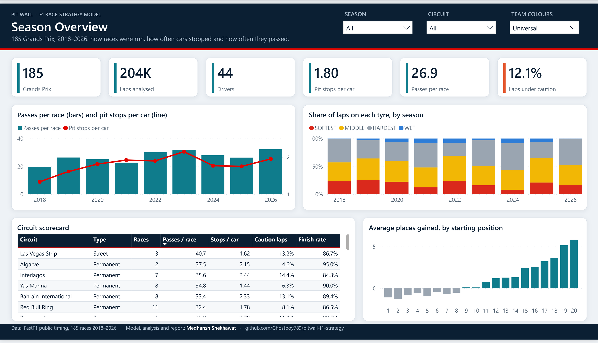
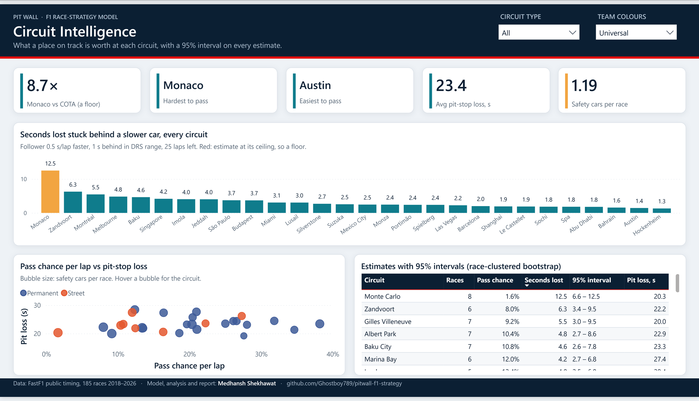
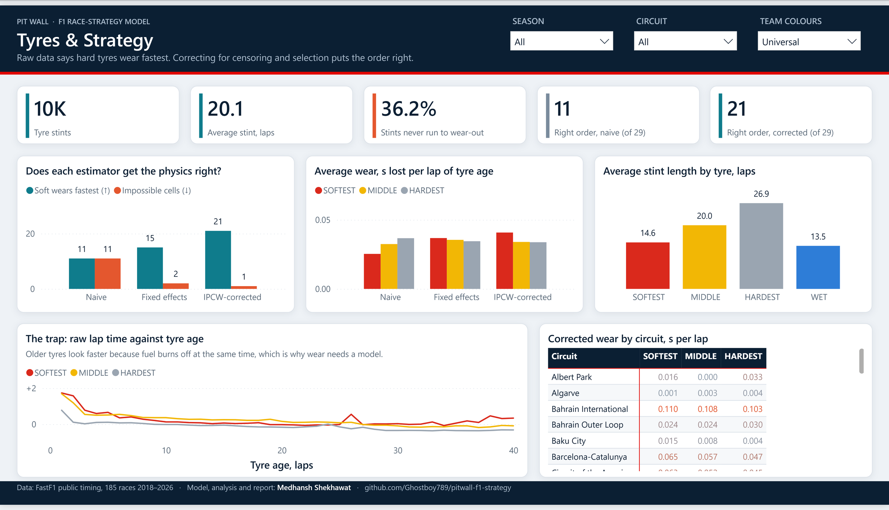
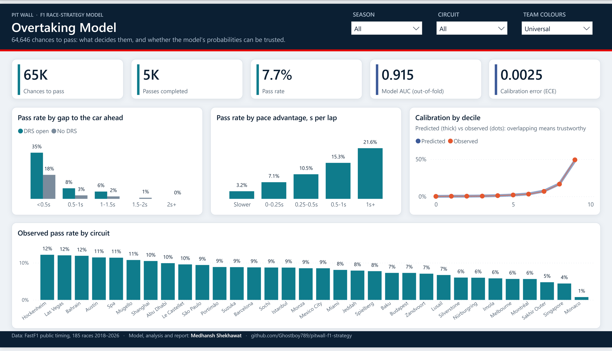
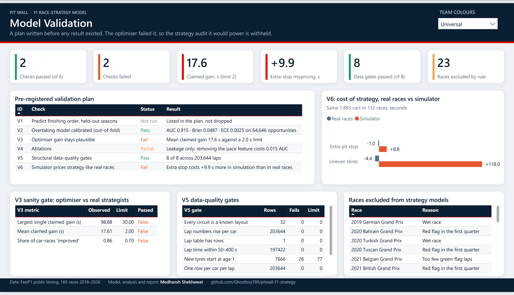
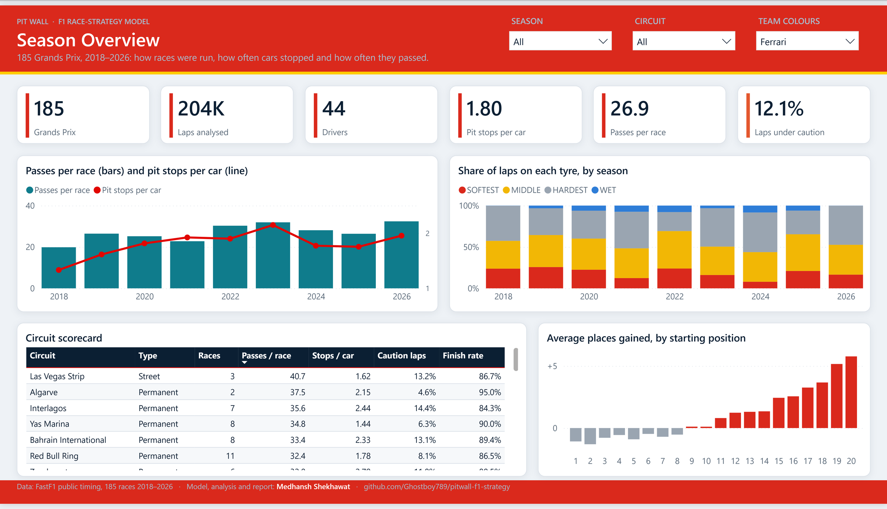
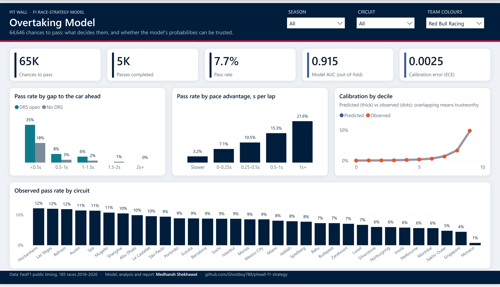
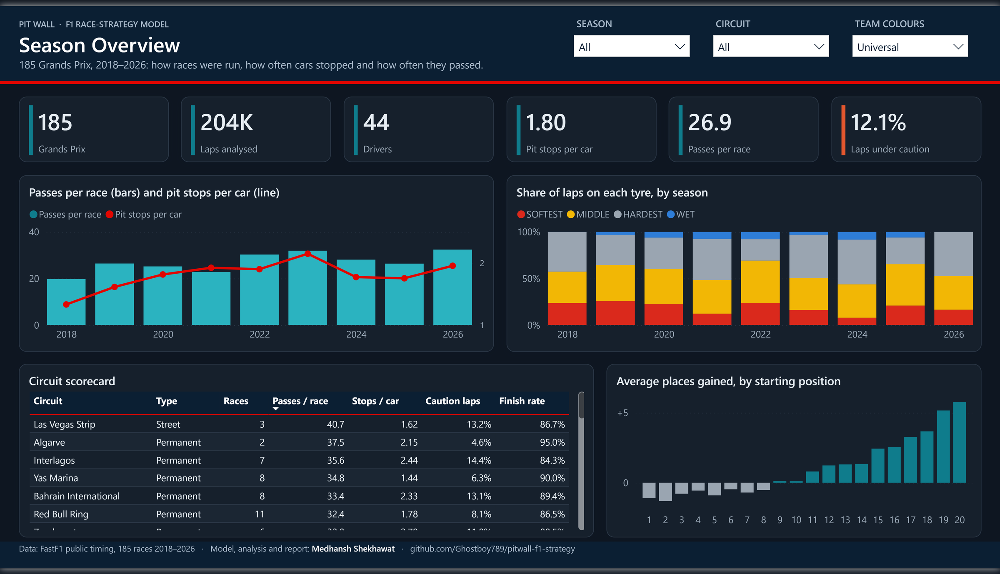
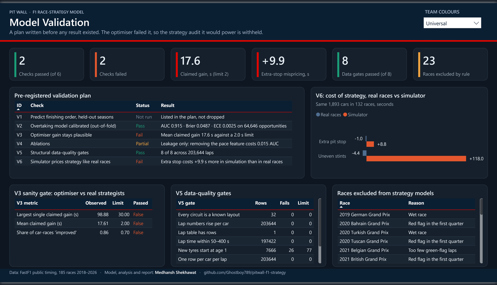

# Pit Wall · Power BI report

A five-page Power BI report over the same data and fitted models as the [live dashboard](https://pitwall-f1-strategy.onrender.com). It is built as a star schema and a DAX measure layer, and its numbers are checked against the Python pipeline.



## Open it

1. Install [Power BI Desktop](https://www.microsoft.com/power-bi/desktop) (Windows, free).
2. Clone the repository and open **`powerbi/PitWall.pbip`**.
3. Click **Refresh**. The data loads from this repository's `powerbi/data` folder on GitHub, about 3 MB, in roughly 15 seconds. The first time, Power BI asks how to connect to the web source: choose **Anonymous**, then **Connect**.

To work offline, set the `DataFolder` parameter (Transform data → Edit parameters) to your local `powerbi\data\` path.

**Dark mode:** View → Themes → Browse for themes → `powerbi/themes/PitWall-Dark.json`. All report colours come from the theme, so the whole report switches.

**Team colours:** the **Team colours** menu in every page header re-skins the report (header band, stripe and chart accents) in any 2026 team's colours, or the default *Universal* scheme. The menus are synced, so a choice on one page carries to all five. The colours come from `powerbi/data/team_themes.csv`, the same file the website uses.

## Pages

| Page | Question it answers |
|---|---|
| **Season Overview** | How were 185 Grands Prix run: passes per race, pit stops per car, tyre mix by season, places gained by grid slot |
| **Circuit Intelligence** | What a place on track is worth at every circuit, with 95% intervals, against pit loss and safety-car risk |
| **Tyres & Strategy** | Why raw data gets tyre wear backwards, and what fixed effects and censoring weights change |
| **Overtaking Model** | What decides a pass (gap, DRS, pace), and whether the model's probabilities are calibrated |
| **Model Validation** | The pre-registered plan, the failed sanity gate, the real-vs-simulated backtest, data gates, exclusions |

| | |
|---|---|
|  |  |
|  |  |

Team colours (Ferrari, Red Bull Racing):

| | |
|---|---|
|  |  |

Dark theme:

| | |
|---|---|
|  |  |

## Model

```
                 Circuit ──< Race >──┬──< Lap >── Tyre Compound
                    │                ├──< Result
   Tyre Wear Estimate               ├──< Stint >── Tyre Compound
                                     └──< Overtaking Opportunity
         Driver ──< Lap, Result, Stint, Overtaking Opportunity
```

- **Facts:** `Lap` (203,644 rows), `Overtaking Opportunity` (64,646), `Stint` (10,421), `Result` (3,723).
- **Dimensions:** `Race`, `Circuit`, `Driver`, `Tyre Compound`. The compound is ranked within each event because Pirelli's labels are relative.
- **Theme:** a disconnected table of team colour schemes behind the Team colours menu.
- **Evidence tables:** tyre-wear estimates under four estimators, and the V1–V6 validation outputs.
- **Key Measures:** 57 DAX measures in display folders, including filter-aware headline-circuit selection, the Monaco-vs-COTA ratio, and colour measures that drive conditional formatting and the team themes.

The model is stored as TMDL and the report as PBIR, so every table, measure and visual is a readable text file that diffs in git. `scripts/export_powerbi.py` rebuilds `powerbi/data` from the pipeline outputs.

## How it was checked

- **Numbers:** 48 DAX queries against the loaded model compare every KPI with an independent pandas calculation or the published artefact, both unfiltered and under season, circuit and circuit-type filters. All 48 match. `tests/test_powerbi_data.py` keeps the extract consistent with `models_out` in CI.
- **Referential integrity:** no fact row fails to join its race, driver, circuit or compound.
- **Definitions:** 0 errors from Microsoft's PBIR validator, the TMDL validator, and `pbir validate`.
- **Rendering:** every page was screenshotted in both themes and inspected for clipped labels, truncated values, hidden series and unreadable colours.

**Withheld on purpose:** the per-team and per-driver strategy audit is not in this report. It depends on the optimiser, which failed its pre-registered sanity gate (see the Model Validation page).
